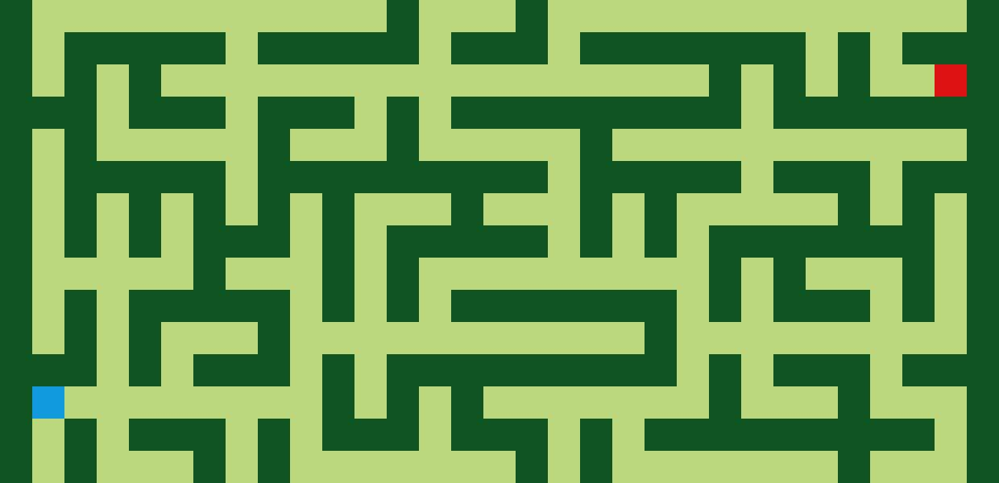
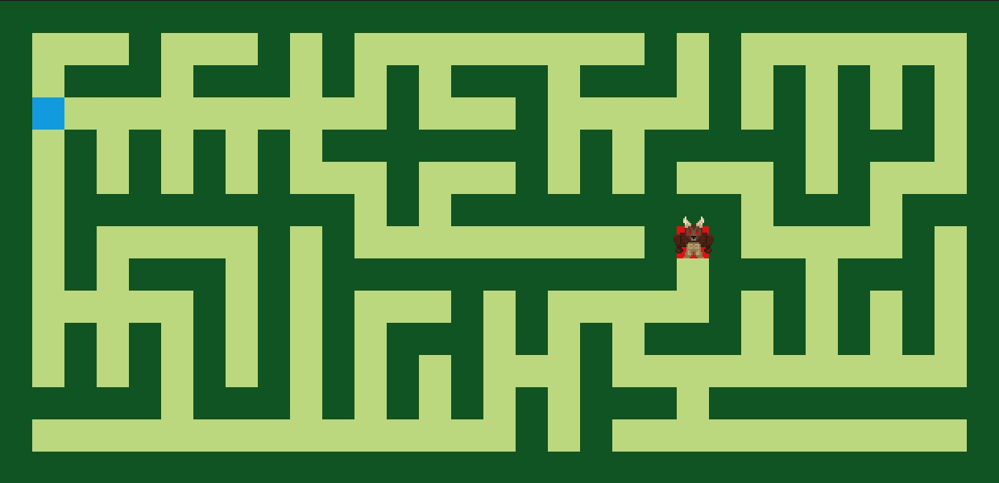

# Minotaur Escape

## Sobre 
Esse projeto gera um novo labirinto cada vez que é conectado, com uma solução garantida, através do uso do algoritmo de Prim, o que faz do labirinto essencialmente uma MST. Juntamente com a micro framework Flask, transformamos esse labirinto num joguinho, onde o Minotauro deve percorrer o labirinto até chegar em sua saída.

## Screenshots

    

## Instalação 
**Linguagem**: Python, HTML e CSS, JavaScript 
**Framework**: Flask 

Pré-requisitos para rodar o seu projeto e os comandos necessários:

    $ pip install -r requirements.txt

Para rodar apenas o algoritmo de Prim e gerar o JPEG de um labirinto:

    $ python3 maze.py

Para rodar o projeto no browser:

    $ flask run
    // ou
    $ python app.py

## Uso 

Após o server do Flask iniciar, abra o projeto em localhost:5000

